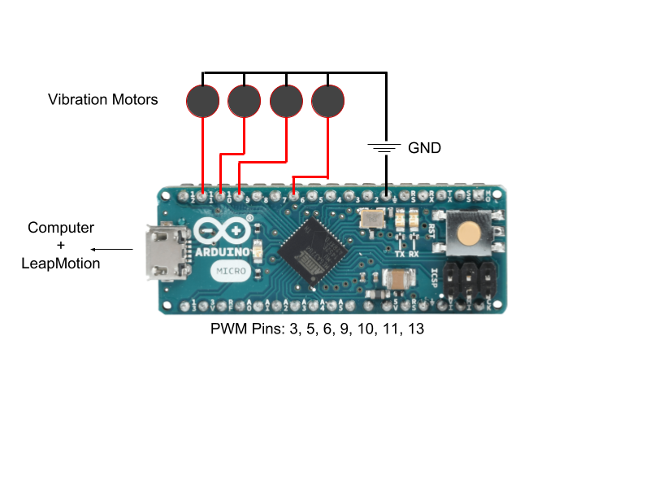

# Mathemagica: Visualizing Mathematical Relations using Haptic Feedback
MIT 6.835 Term Project - LeapMotion + Haptic Feedback + Math
[Carlos Henríquez](https://github.com/mysticuno), [Erica Yuen](https://github.com/ejyuen)
{carlosh, ejyuen}@mit.edu

## Installation

Run `npm install` then `node index.js` to start serving the web app. It is recommended that you use NVM to run the project with Node 8.0.0 (npm 5.0.0). If you have [NVM](https://github.com/creationix/nvm) installed, run `nvm run 8.0.0 index.js`.

You will need to have access to a [Leap Motion](https://www.leapmotion.com/), an [Arduino Micro](https://store.arduino.cc/usa/arduino-micro) and a few [vibration motors](https://www.amazon.com/12000RPM-Mobile-Phone-Vibrating-Vibration/dp/B00GN67918). You will need to flash the Arduino with [Standard Firmata](https://github.com/firmata/arduino), which is included in this directory under [firm ino](./firm_ino/).

The software was developed on Windows 10 using the Windows Subsystem for Linux as the development environment. This affects how the system identifies the the port that the Arduino is connected to. You can find what port the Arduino is connected at by opening up the Arduino IDE and selecting `Tools -> Serial Port`. You should see something like `COM5` as the port. 

Node can't normally write to the COM ports from WSL, so you will need to `sudo chmod 666 /dev/ttyS#` where # is the COM port the arduino is connected at. If this is being launched not from a WSL command line such as Bash, setting the COM port variable in [index.js](./index.js) should also work.

You will need to make sure that the Leap Service is also running in the background, otherwise the system will complain about the appropriate websocket not being open.

The current hardware is setup to use the index, middle, ring, and pinky fingers. The logic for adding a thumb exists and would just required adding a motor to one of Arduino Micro PWM pins: `3, 5, 6, 9, 10, 11 or 13` ([source](https://store.arduino.cc/usa/arduino-micro)). Currently, pins 10, 9, 6 and 11 are mapped to the index, middle, ring, and pinky fingers, respectively. The pinout for the Arduino Micro is:



## List of files

```
.
├ firm_ino/
│   └ firm_ino.ino         // The Standard Firmata file with which to flash the Arduino
├ index.html               // The HTML for the web interface
├ index.js                 // The main server file
├ lib/                     // Libraries used for JavaScript dependencies
├ Mathemagica.pdf          // The project writeup
├ node_modules/            // Dependencies for the server
├ package.json			   // Lists required packages
├ package-lock.json
├ public/
│   ├ Detector.js          // Dependency for LeapCursor.js
│   ├ famous.css           // Some styling
│   ├ LeapCursor.js        // Handles to creation of the cursor and firing of custom events
│   ├ leap.min.js          // Leap JavaScript SDK
│   ├ leap-plugins.min.js  // Plugins for Leap.js, dependency for LeapCursor.js
│   ├ mathemagica.js       // Controller for the web app, communicates with the server
│   └ three.min.js         // Dependency for Leap.js
└ README.md
```

## Debugging

Mathemagica can also be run without an Arduino for debugging purposes. Set `useHardware = false;` in [index.js](./index.js) to interact with the web app without having to connect with to an Arduino.
